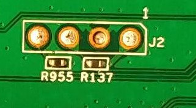

# Info

## Custom Firmware Installation

Dlink DIR-819 firmware above version V1.1+ will have to downgroud to Version V1.0 and then go to version V1.2

Dir-819's web interface verifies the firmware signature, and it (Brazilian model) does not have Recovery mode. then we have to downgroud to version V1.0 and then upgrade to version V1.02 (Decrypted).

### File steps

1. Flash file in Web Interface: Dir-819_V1.0.bin to Downgrade to V1.0
2. Flash file in Web Interface: DIR-819_A1_V1.02_ Unencrypt.bin to Upgrade to V1.02
3. Flash Openwrt image in Web Interface: DIR-819_A1_V1.02_ Openwrt.bin
    - Not everything has been properly tested for him.
    - Check the image is correct, otherwise the router will not be able to upload the firmware.
        - If the CPU is warming up and the following LEDs are on, turn it off, you will have to write the DLINK image with an 8MB Flash bios recorder.
            - WAN
            - WPS
            - Wireless: 2.4ghz
            - Power led

## Serial Connection

A serial connection was not successful.

## J2 Pins

- VCC
- ?
- GND
- VCC

